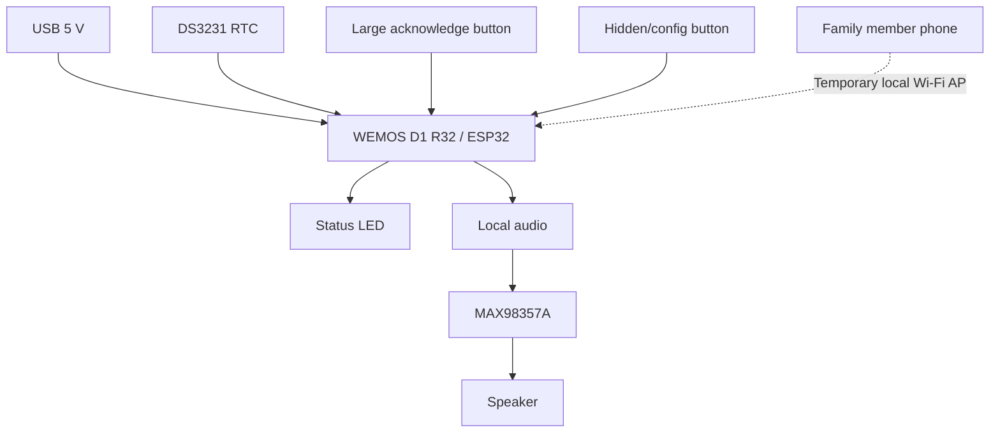

# MedicineAlarm

A simple, offline-first medication reminder designed for older adults who should not need a smartphone, smartwatch, account, or complicated interface just to remember a dose.

MedicineAlarm started from a real family need: helping my wife's grandparents remember medication times reliably despite low vision and limited comfort with digital devices.

The design goal is intentionally narrow:

> **Hear the reminder. Press one large button. That's it.**

> [!IMPORTANT]
> MedicineAlarm is an assistive reminder project, not a medical device. Acknowledging an alarm means the reminder was acknowledged; it does **not** prove that medication was taken.

## Why this project exists

Many medication reminder solutions assume the user can comfortably read a small display, use a mobile app, wear a smartwatch, or interact with a voice assistant.

This project explores a different set of constraints:

- low-vision friendly;
- minimal physical interaction;
- works without internet during normal operation;
- no cloud account;
- no mobile app;
- local configuration by a family member/caregiver;
- audible voice reminders;
- survives reboots without losing schedules;
- inexpensive and reproducible hardware;
- enclosure and large button can be 3D printed.

## Current status

**Prototype in active development — Days 1–3 validated on hardware.**

Working today:

- ESP32/WEMOS D1 R32 selected after comparison with NodeMCU ESP8266;
- 10 persistent alarm slots;
- physical acknowledge button;
- LED status feedback;
- buzzer placeholder for audio;
- watchdog enabled;
- local Wi-Fi access point for configuration;
- mobile-friendly local configuration page;
- alarm test from the web UI;
- settings survive reboot.

Next:

- DS3231 real-time clock;
- local voice playback;
- MAX98357A + speaker;
- 3D-printed enclosure and large button actuator;
- real-world supervised testing.

## Architecture



Normal operation does not require Wi-Fi. The access point is enabled only for configuration and can be disabled afterward.

## Hardware direction

Current MVP target:

| Component | Role | Status |
|---|---|---|
| WEMOS D1 R32 / ESP32 | Main controller | ✅ Selected |
| DS3231 | Offline timekeeping | ⏳ Next |
| MAX98357A | I²S audio amplifier | ⏳ Planned |
| 4 Ω / 3 W speaker | Voice output | ⏳ Planned |
| Push button | Acknowledge reminder | ✅ Bench-tested |
| LED + 560 Ω resistor | Visual feedback | ✅ Bench-tested |
| Active buzzer | Temporary alarm output | ✅ Bench-tested |
| USB 5 V supply | MVP power | ✅ |
| Battery / UPS | Backup power | Later |

The first audio path to validate is **internal flash + MAX98357A**, avoiding microSD if practical. **DFPlayer Mini + microSD** remains the fallback if local flash/audio decoding becomes unnecessarily complex.

## Measured platform results

Two controllers were tested before choosing the MVP platform:

| Board | Flash | Free heap at basic boot | Notes |
|---|---:|---:|---|
| NodeMCU ESP8266 | 4 MB | ~51.9 KB | Smaller board, viable for simpler IoT tasks |
| WEMOS D1 R32 / ESP32 | 4 MB | ~350 KB | Selected; much larger RAM margin and native I²S support |

On the selected ESP32 prototype:

- LittleFS total: **~1.38 MB**
- LittleFS free during the flash test: **~1.37 MB**
- heap before Wi-Fi AP: **~307 KB**
- heap with Wi-Fi AP active: **~254 KB**

These measurements keep the no-microSD audio path viable for short compressed voice messages.

## User interaction

### Daily use

```text
scheduled time
     ↓
voice reminder + LED
     ↓
large physical button
     ↓
reminder acknowledged
```

### Configuration

```text
enter configuration mode
     ↓
ESP32 creates a temporary Wi-Fi network
     ↓
family member connects with a phone
     ↓
opens local web page
     ↓
edits schedules
     ↓
saves and exits
     ↓
Wi-Fi off
```

## Repository layout

```text
.
├── src/                    # ESP32 firmware
├── docs/
│   ├── architecture.md     # System design and boundaries
│   ├── hardware.md         # Wiring, BOM and measured hardware data
│   ├── roadmap.md          # 7-day MVP plan and status
│   └── decisions.md        # Key engineering decisions
├── hardware/
│   ├── wiring/             # Future diagrams / schematics
│   └── case/               # Future STL/CAD files
├── platformio.ini
├── LICENSE
└── README.md
```

## Build

The project uses [PlatformIO](https://platformio.org/) with the Arduino framework.

```bash
pio run -e d1r32
pio run -e d1r32 -t upload
pio device monitor -b 115200
```

Serial port selection is intentionally not committed because Linux device names vary between machines.

## Development philosophy

This is a small assistive device, so simplicity is a feature.

The project follows a few rules:

- validate the real user flow before adding infrastructure;
- prefer offline behavior;
- avoid cloud dependencies unless they solve a demonstrated problem;
- keep the interface simpler than the problem it solves;
- prefer a working, testable MVP over speculative complexity;
- add battery, remote monitoring, OTA, and custom PCB only after the core interaction is proven.

## Roadmap

See [docs/roadmap.md](docs/roadmap.md).

## License

Software in this repository is licensed under the [Apache License 2.0](LICENSE).

Licensing for future CAD/STL or other hardware design files may be stated separately when those artifacts are added.
