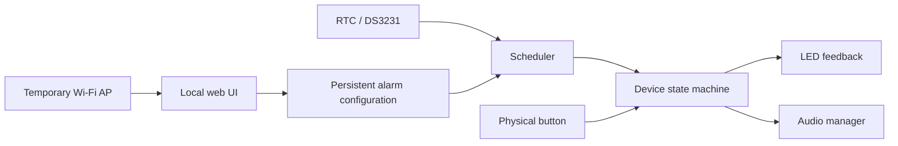

# Architecture

## Product boundary

MedicineAlarm is an **assistive reminder**, not a medication dispenser and not a system that verifies ingestion.

The MVP has one job: issue a clear reminder at configured times and make acknowledgement easy.

## Design principles

1. **Offline first** — normal operation must not depend on internet access.
2. **Minimal interaction** — the older adult should not need to navigate menus.
3. **Caregiver configuration** — setup complexity belongs on the caregiver side.
4. **Fail simple** — after reboot, schedules should still exist and the device should return to normal operation.
5. **No unnecessary cloud** — remote features are deferred until the local experience is proven.
6. **Accessible by design** — voice and a large physical button matter more than a small display.

## Logical components



## States

Current firmware uses a deliberately small state model:

- **IDLE** — waiting for a future reminder;
- **ALARM** — reminder active until acknowledged;
- **configuration mode** is tracked separately because Wi-Fi can be enabled without changing the alarm semantics.

Future scheduler logic will add time-driven transitions from IDLE to ALARM.

## Persistence

Alarm slots and acknowledgement counters are stored in ESP32 NVS using `Preferences`.

Current prototype stores:

- 10 alarm slots;
- hour;
- minute;
- enabled flag;
- acknowledgement count.

Planned next data-model evolution:

- each slot belongs to one of two recipient profiles (grandfather / grandmother);
- recipient display names are configuration data and will be added when available;
- medication-specific names remain optional/deferred until the real medication list and audio workflow are known.

The RTC will provide wall-clock time; NVS remains responsible for configuration persistence.

## Networking

The ESP32 does **not** join the home network during normal operation.

Configuration flow:

1. long-press configuration control;
2. ESP32 starts a local access point;
3. caregiver connects from a phone;
4. local web server exposes alarm settings;
5. configuration is saved to NVS;
6. AP is disabled.

This keeps the product usable in homes without internet and avoids account provisioning.

## Audio strategy

Preferred:

```text
LittleFS / internal flash
        ↓
ESP32 audio decode / I²S
        ↓
MAX98357A
        ↓
speaker
```

Fallback:

```text
ESP32
  ↓
DFPlayer Mini
  ↓
microSD
  ↓
speaker
```

The fallback exists to protect the delivery schedule. If local audio decoding/storage becomes disproportionately complex, the project will use the simpler dedicated audio module.

## Power

MVP:

```text
USB 5 V → board
```

Later:

- battery backup;
- proper charge/protection circuit;
- power-path / automatic switchover;
- battery state monitoring.

A TP4056 alone is not considered the final UPS architecture.


## Reminder lifecycle

For the MVP, schedules are daily.

When one or more enabled alarm slots match the current minute:

1. the device enters ALARM;
2. the corresponding recipient message is played;
3. the reminder repeats at a controlled interval;
4. repetition continues indefinitely until the physical button is pressed;
5. acknowledgement returns the device to IDLE.

The repeat interval is intentionally not fixed yet; it should be validated with the real users rather than guessed in software.

If reminders for both recipient profiles are due at the same minute, the event model must preserve both matches so neither person is silently omitted.
